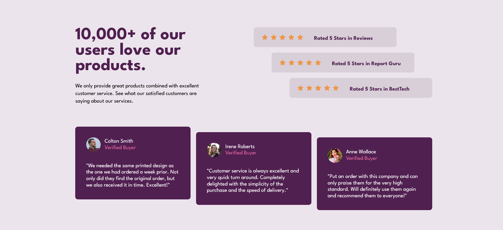

# Frontend Mentor - Social proof section solution

This is a solution to the [Social proof section challenge on Frontend Mentor](https://www.frontendmentor.io/challenges/social-proof-section-6e0qTv_bA). Frontend Mentor challenges help you improve your coding skills by building realistic projects.

## Table of contents

- [Overview](#overview)
  - [The challenge](#the-challenge)
  - [Screenshot](#screenshot)
  - [Links](#links)
- [My process](#my-process)
  - [Built with](#built-with)
  - [What I learned](#what-i-learned)
  - [Continued development](#continued-development)
  - [Useful resources](#useful-resources)
- [Author](#author)
- [Acknowledgments](#acknowledgments)

## Overview

The challenge was to build out this social proof section and get it looking as close to the design as possible.

### The challenge

Users should be able to:

- View the optimal layout for the section depending on their device's screen size

### Screenshot

### Links

- Solution URL: [Add solution URL here](https://your-solution-url.com)
- Live Site URL: [Add live site URL here](https://your-live-site-url.com)

### Built with

- Semantic HTML5 markup
- CSS custom properties
- Flexbox
- Mobile-first workflow

### What I learned

 tags in html will have some whitespace after them. This is actually a textnode caused by the newline character and will prevent the image from vertically aligning as expected. To get rid of this whitespace, we can either change the html to have the img tags side by side ie. , or we can set the font-size of the images to 0. The latter solution is much faster and better in my opinion.

I experimented with splitting up the element styles and layout styles into 2 seperate sections in my styles.css file. However I found that this caused me to have repeat too many selectors and I wont be doing this again.

## Author

- Name - Paul Ryan
- Frontend Mentor - https://www.frontendmentor.io/profile/Gunner40
- Twitter - @Gunner40
